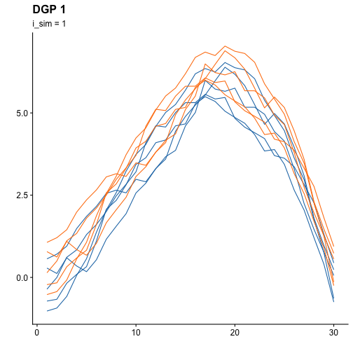
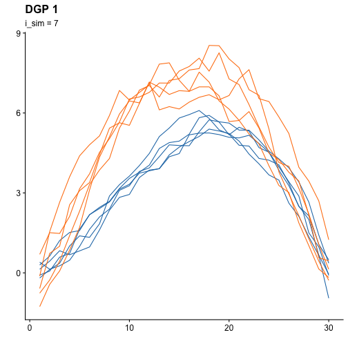
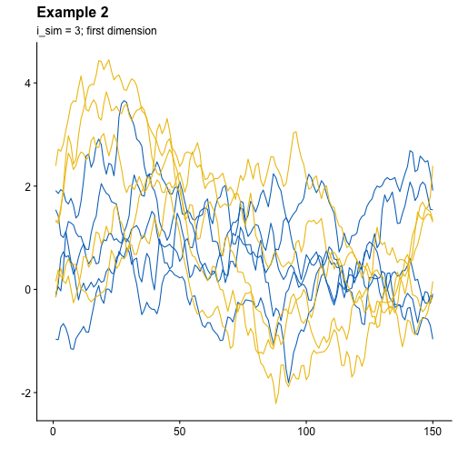
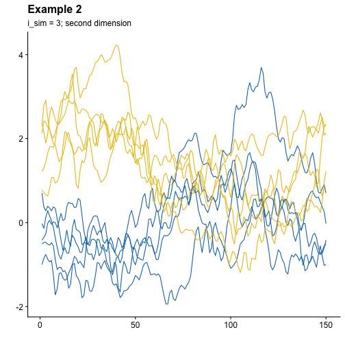
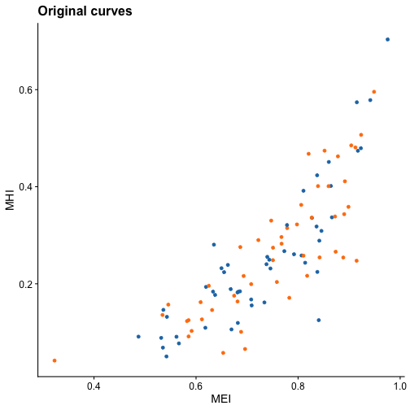
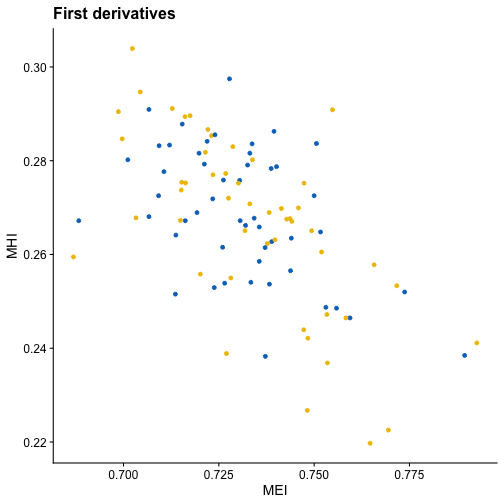

``` {r include = FALSE}
set.seed(42)

library(ehymet)
```

# `ehymet` package goal {#sec-goal}

The **ehymet** package (**E**pigraph-**Hy**pograph based **met**hodologies for
functional data) is an `R` package designed to extend popular multivariate 
data analysisi methodologies to functional data using various indices. The 
package introduces the **epigraph** and **hypograph** indices, along with their 
modified versions for functional datasets in one or multiple dimensions. These 
indices transform a functional dataset into a multivariate one, enabling the 
application of existing multivariate data analysis methods.

More information about the theory behind these methodologies can found in the
following papers:

-   Belén Pulido, Alba M. Franco-Pereira, Rosa E. Lillo (2023). “A fast
    epigraph and hypograph-based approach for clustering functional data.”
    *Statistics and Computing*, **33**, 36. doi:
    [10.1007/s11222-023-10213-7](https://doi.org/10.1007/s11222-023-10213-7)

-   Belén Pulido, Alba M. Franco-Pereira, Rosa E. Lillo (2023). “The epigraph
    and the hypograph indexes as useful tools for clustering multivariate
    functional data.” doi:
    [10.48550/arXiv.2307.16720](https://doi.org/10.48550/arXiv.2307.16720)

# DGPs introduced in the package

The package introduces two functions which generate different data generation
processes (DGPs) for functional data in one or multiple dimension. The first 
function, `sim_model_ex1`, generate DGPs in one dimension as originally 
described by [@flores_homogeneity_2018]. The second function, `sim_model_ex2`,
produces DGPs in both one and two dimensions first introduced by
[@martino_k-means_2019].

These functions are useful for simulating functional data to test statistical
methods or to understand the behavior of different models under controlled
conditions. Each of the two functions display different DGPs depending on the 
given parameters, each of them with diferent characteristics.

## Type 1 DGPs

The first set of DGPs is generated by function `sim_model_ex1`, which produces
eight different DGPs, each corresponding to a different value of `i_sim`.
Here’s a breakdown of how each DGP is generated and how the function works:

### Parameters

-   **n**: The number of curves to generate **for each group**. By default,
    this is set to 50 per group, resulting in a total of 100 curves.
-   **p**: The number of grid points at which the curves are evaluated over
    the interval $[0, 1]$. The default is 30 grid points.
-   **i_sim**: An integer between 1 and 8 that specifies which model to use
    for generating the curves in the second group. The first group of curves is
    generated in the same way for all values of `i_sim`.
-   **seed**: A seed for random number generation to ensure reproducibility.
    If not provided, the randomness is not fixed.

### Function breakdown

The first group of functions is generated by a Gaussian process 
$$X_1(t)=E_1(t)+e(t),$$ 
where $E_1(t)=30t^{ \frac{3}{2}}(1-t)$ is the mean function and $e(t)$ is a 
centered Gaussian process with covariance matrix 
$$ Cov(e(t_i),e(t_j))=0.3 \exp\left(-\frac{\lvert t_i-t_j \rvert}{0.3}\right).$$

The second group of functions $X_i$ are obtained from the first one by 
perturbing the generation process. Different values of `i_sim` generate 
different curves.

For `i_sim` values of 1, 2, and 3, the curves in the second group exhibit changes 
in the mean while the covariance matrix remains unchanged. The changes in the 
mean increase in magnitude as `i_sim` increases.

- **i_sim = 1**: $X_i(t)=X_1(t)+0.5.$

- **i_sim = 2**: $X_i(t)=X_1(t)+0.75.$

- **i_sim = 3**: $X_i(t)=X_1(t)+1.$

For `i_sim` 4 and 5, the curves in the second group are obtained by multiplying 
the covariance matrix by a constant.

- **i_sim = 4**: $X_i(t)=E_1(t)+2 \ e(t).$

- **i_sim = 5**: $X_i(t)=E_1(t)+0.25 \ e(t).$

For `i_sim = 6`, the curves in the second group are obtained by adding to 
$E_1(t)$ a centered Gaussian process $h(t)$ whose covariance matrix is given by 
$$ Cov(h(t_i),h(t_j))=0.5 \exp (-\frac{\lvert t_i-t_j\rvert}{0.2})$$. 

- **i_sim = 6**: $X_i(t)=E_1(t)+ \ h(t).$

For `i_sim` 7 and 8, the curves in the second group are obtained by a different 
mean function $E_2(t)=30t{(1-t)}^2$.

- **i_sim = 7**: $X_8(t)=E_2(t)+ h(t).$
- **i_sim = 8**: $X_9(t)=E_2(t)+ e(t).$


### Output

The function returns a data matrix of size $2n \times p$, where the first $n$
rows contain the curves from the first group, and the next $n$ rows contain the 
curves from the second group, generated according to the selected value of
`i_sim`.

### Usage

To simulate the curves, we can follow these steps:


``` r
n <- 5
curves <- sim_model_ex1(n = n, i_sim = 1)
dim(curves)
#> [1] 10 30
```

This code generated 10 curves over the interval [0,1] with 30 grid points, using 
`i_sim`=1

Also, we can plot them. To do so, we are going to load external packages. This
is just an example of how to plot the curves, but the end user can do it the
way they want.

``` r
print(plt_fun(curves, c(rep(1,5), rep(2,5))))
```

``` r
library(tidyr)
library(dplyr)
library(ggplot2)
library(ggsci)
library(cowplot)

plot_curves <- function(curves, title = "", subtitle = "") {
  data <- as.data.frame(curves) |> 
    mutate(curve_id = row_number())
  n <- dim(curves)[1] / 2

  data_long <- data |>
    pivot_longer(
      cols = -curve_id,
      names_to = "point",
      values_to = "value"
    ) %>% 
    mutate(
      point = as.numeric(sub("V", "", point)),
      group = if_else(curve_id %in% 1:n, 1, 2)
    )
  
  ggplot(data_long, aes(x = point, y = value, group = curve_id, color = as.factor(group))) +
    geom_line() +
    labs(
      title    = title,
      subtitle = subtitle,
      color    = "Group",
      x        = "",
      y        = ""
    ) +
    scale_color_jco() +
    theme_half_open() +
    theme(legend.position = "none")
}

plot_curves(curves, title = "Example 1", subtitle = "i_sim = 1")
```



The case of `i_sim = 7` has the following graph representation:



Clear differences can be seen between both plots. We leave it up to the end
user to experiment with the simulations as they see fit.

## Type 2 DGPs

The second set of DGPs is generated by function `sim_model_ex2`, which produces
four different DGPs, each corresponding to a different value of  **i_sim**. The 
first two DGPs are in one dimension, while the remaining two DGPs are 
two-dimensions functional datasets. Here’s a breakdown of how each DGP is 
generated and how the function works:

### Parameters

-   **n**: The number of curves to generate **for each group**. By default,
    this is set to 50 per group, resulting in a total of 100 curves.
-   **p**: The number of grid points at which the curves are evaluated over
    the interval $[0, 1]$. The default is 150 grid points.
-   **i_sim**: An integer between 1 and 4. 1 and 2 for one-dimensional 
    functional data and 3 and 4 for the multidimensional case.
-   **seed**: A seed for random number generation to ensure reproducibility.
    If not provided, the randomness is not fixed.

### Function breakdown

For the **one-dimensional case** the first group of functions is generated by 
$$X_{1}(t)=E_3(t)+ A(t),$$ 
where $E_3(t)=t(1-t)$ is the mean function, and 
$$A(t) =  \sum_{k=1}^{100} Z_k\sqrt{\rho_k}\theta_k(t),$$
with $\{Z_k, k=1,...,100\}$ being independent standard normal variables, and 
$\{ \rho_k,k\geq 1 \}$ a positive real numbers sequence defined as 
$$\rho_k = \left\{
	       \begin{array}{lll}
		 \frac{1}{k+1}      & if & k \in \{1,2,3\}, \\
		 \frac{1}{{(k+1)}^2} & if & k \geq 4,
	       \end{array}
	     \right. $$
in such a way that the values of $\rho_k$ are chosen to decrease faster when 
$k\geq 4$ in order to have most of the variance explained by the first three 
principal components. The sequence $\{\theta_k, k\geq 1\}$ is an orthonormal 
basis of $L^2(I)$ defined as
$$\theta_k(t) = \left\{
	       \begin{array}{lllll}
		 I_{[0,1]}(t)    & if & k=1, &  \\
		 \sqrt{2}\sin{(k\pi t)}I_{[0,1]}(t) & if & k \geq 2,\\ & & k \ even,\\
		 \sqrt{2}\cos{((k-1)\pi t)}I_{[0,1]}(t)  & if & k \geq 3,\\ & & k \ odd,
	       \end{array}
	     \right. $$
where $I_A(t)$ stands for the indicator function of set $A$.

The second group of data is generated as follows, depending on the value of 
`i_sim`:

 - **i_sim = 1**: $X_{i}(t)=E_4(t)+ A(t),$ where $E_4(t)=E_2(t)+\displaystyle \sum_{k=1}^3\sqrt{\rho_k}\theta_k(t).$

 - **i_sim = 2**: $X_{i}(t)=E_5(t)+ A(t),$ where $E_5(t)=E_2(t)+\displaystyle \sum_{k=4}^{100}\sqrt{\rho_k}\theta_k(t).$

For the **two-dimensional case** the first group of functions is generated by
$$\mathbf{X}_{1}(t)=\mathbf{E}_6(t)+ B(t),$$ 
where $\mathbf{E}_6(t)= 
\begin{pmatrix}
    t(1-t)\\
    4t^2(1-t)
\end{pmatrix}$ is the mean function of this process, and 
$$\mathbf{B}(t) = \sum_{k=1}^{100} \mathbf{Z}_k\sqrt{\rho_k}\theta_k(t),$$
where $$\mathbf{E}_6(t)=
\begin{pmatrix}
    t(1-t)\\
    4t^2(1-t)
\end{pmatrix}$$
 is the mean function of this process, $\{\mathbf{Z}_k, k=1,...,100\}$  are 
 independent bivariate normal random variables, with mean $\mathbf{\mu = 0}$ 
 and covariance matrix 
 $$\Sigma=
 \begin{pmatrix}
    1 & 0.5\\
    0.5 & 1
\end{pmatrix}.$$
The second group of data is generated as follows, depending on the value of 
`i_sim`:

 - **i_sim = 3**: $X_{i}(t)=\mathbf{E}_7(t)+ B(t),$ where 
 $\mathbf{E}_7(t)=\mathbf{E}_6(t)+\mathbf{1}\displaystyle \sum_{k=1}^3\sqrt{\rho_k}\theta_k(t),$
  is the mean function of this process, where $\mathbf{1}$ represents a vector 
  of 1s.

 - **i_sim = 4**: $X_{i}(t)=\mathbf{E}_8(t)+ B(t),$ where 
 $\mathbf{E}_8(t)=\mathbf{E}_6(t)+\mathbf{1}\displaystyle \sum_{k=4}^{100}\sqrt{\rho_k}\theta_k(t).$


### Output

The function returns for the **one-dimensional case** (`i_sim=1,2`) a data 
matrix of size $2n \times p$. The output for the **two-dimensional case** 
(`i_sim=3,4`)is an array of dimensions $2n \times p \times 2$.

### Usage

This function generates functional curves in one dimension for values of `i_sim`
equal to 1 and 2, and functional datasets in two dimensions for values of `i_sim`
equal to 3 and 4. Here, we would like to point out how to simulate a 
multivariate functional dataset with `i_sim = 3` or `i_sim = 4`.


``` r
n <- 5
curves <- sim_model_ex2(n = n, i_sim = 3)
dim(curves)
#> [1]  10 150   2
```

As can be seen, now we don't have a matrix but a 3-dimensional array. We are
going to plot the first dimension:



And now the second dimension:



# Indices computation

As mentioned above, [the main contribution of the package](#sec-goal) is the
implementation of the epigraph and the hypograph index, both in one and
multiple dimensions. The function to generate the indices is
`generate_indices` and It can compute:

-   **Epigraph Index** (EI)
-   **Hypograph Index** (HI)
-   **Modified Epigraph Index** (MEI)
-   **Modified Hypograph Index** (MHI)

The `indices` parameter can be specified to calculate a subset of the total
indices, but by default it calculates all of them.

To try the indices, let's generate multidimensional data with `sim_model_ex2`:


``` r
curves <- sim_model_ex2(i_sim = 3)
dim(curves)
#> [1] 100 150   2
```

And now compute the indices for the multidimensional data:


``` r
indices_mult <- generate_indices(curves)
```

We can check that all the indices are computed for each curve and for its
first and second derivative:


``` r
names(indices_mult)
#>  [1] "dtaEI"    "ddtaEI"   "d2dtaEI"  "dtaHI"    "ddtaHI"   "d2dtaHI"  "dtaMEI"   "ddtaMEI"  "d2dtaMEI" "dtaMHI"  
#> [11] "ddtaMHI"  "d2dtaMHI"
```

We can also take a quick look to the generated indices:


``` r
head(indices_mult, 3)
#>   dtaEI ddtaEI d2dtaEI dtaHI ddtaHI d2dtaHI    dtaMEI   ddtaMEI  d2dtaMEI    dtaMHI   ddtaMHI  d2dtaMHI
#> 1  0.99   0.99    0.99  0.01   0.01    0.01 0.7018000 0.7325333 0.7407333 0.1966667 0.2790667 0.2684667
#> 2  0.99   0.99    0.99  0.01   0.01    0.01 0.6420000 0.7212000 0.7210667 0.1892667 0.2792667 0.2904667
#> 3  0.99   0.99    0.99  0.01   0.01    0.01 0.4653333 0.7262000 0.7378000 0.1470667 0.2758667 0.2515333
```

Now, for the sake of comparison, let's see what happens if we calculate the
indices separately for each dimension and check the first few rows:


``` r
indices_dim1 <- generate_indices(curves[,,1])
indices_dim2 <- generate_indices(curves[,,2])
```


``` r
head(indices_dim1, 3)
#>   dtaEI ddtaEI d2dtaEI dtaHI ddtaHI d2dtaHI    dtaMEI   ddtaMEI  d2dtaMEI    dtaMHI   ddtaMHI  d2dtaMHI
#> 1  0.87   0.99    0.99  0.03   0.01    0.01 0.3356000 0.4969333 0.5032667 0.3456000 0.5069333 0.5132667
#> 2  0.91   0.99    0.99  0.01   0.01    0.01 0.2908000 0.5111333 0.5106667 0.3008000 0.5211333 0.5206667
#> 3  0.91   0.99    0.99  0.01   0.01    0.01 0.2932667 0.5034667 0.4964667 0.3032667 0.5134667 0.5064667
```


``` r
head(indices_dim2, 3)
#>   dtaEI ddtaEI d2dtaEI dtaHI ddtaHI d2dtaHI    dtaMEI   ddtaMEI  d2dtaMEI    dtaMHI   ddtaMHI  d2dtaMHI
#> 1  0.99   0.99    0.99  0.04   0.01    0.01 0.5528667 0.5046667 0.4959333 0.5628667 0.5146667 0.5059333
#> 2  0.98   0.99    0.99  0.01   0.01    0.01 0.5304667 0.4793333 0.4908667 0.5404667 0.4893333 0.5008667
#> 3  0.96   0.99    0.99  0.01   0.01    0.01 0.3091333 0.4886000 0.4828667 0.3191333 0.4986000 0.4928667
```

One difference that is readily apparent is, for example, for “dtaMHI”. Let's take a look at it:


``` r
head(data.frame(
  dim1 = unname(indices_dim1["dtaMHI"]),
  dim2 = unname(indices_dim2["dtaMHI"]),
  mult = unname(indices_mult["dtaMHI"])
), 5)
#>        dim1      dim2      mult
#> 1 0.3456000 0.5628667 0.1966667
#> 2 0.3008000 0.5404667 0.1892667
#> 3 0.3032667 0.3191333 0.1470667
#> 4 0.2885333 0.7009333 0.2349333
#> 5 0.3094000 0.4431333 0.1602667
```

Let's plot MHI vs MEI for both the original curves and the first derivatives:







# References
